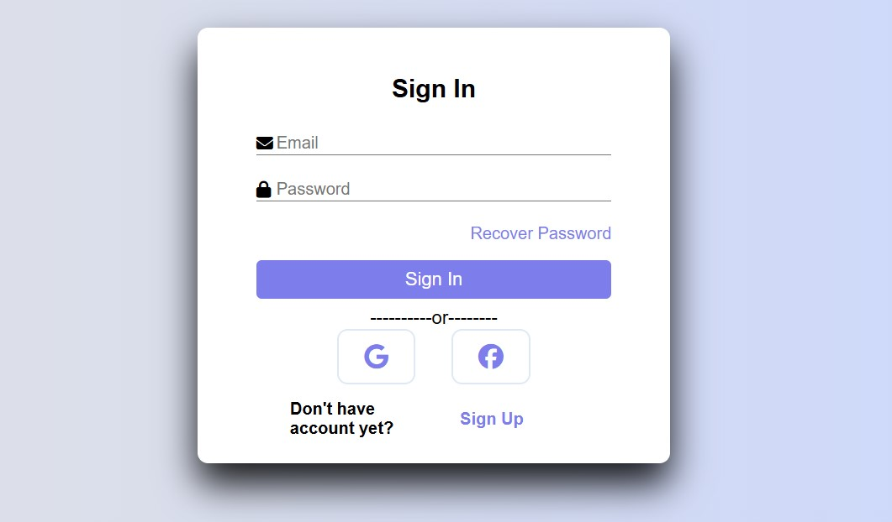

# **🚀 Projeto: FreelaAuth**
---

## **📖 Sobre o Projeto**
Este projeto tem como objetivo [descrever o propósito do projeto]. Ele permite que os usuários [função principal], ajudando a [problema resolvido].

**Principais funcionalidades:**
- ✅ Cadastrar
- ✅ Fazer login
- ✅ Armazenar dados de uma forma segura

---

## **📸 Demonstração**
Aqui está uma prévia do projeto:

<p align="center">
  
</p>

[💻 **Clique aqui para acessar a aplicação**](https://link-para-aplicacao.com)

---

## **🛠 Tecnologias**
As principais tecnologias utilizadas neste projeto são:
- **Frontend**: [HTML5, CSS3, JS]
- **Outras**: [Firebase para autenticação]

---

## **⚙️ Instalação**

1. **Clone o repositório**:
   ```bash
   git clone https://github.com/Kinz2901/FreelaAuth/tree/main
